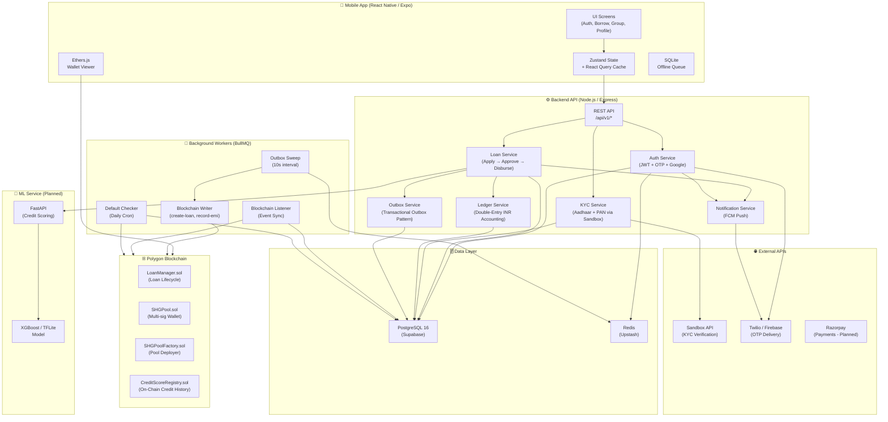
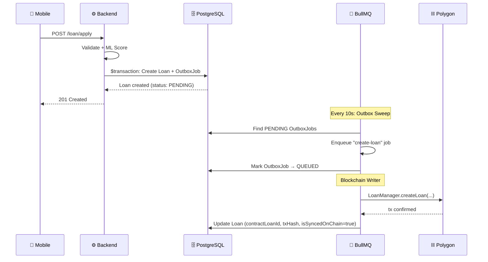
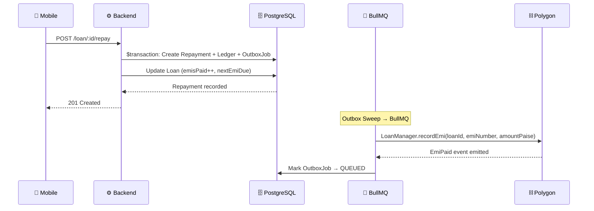
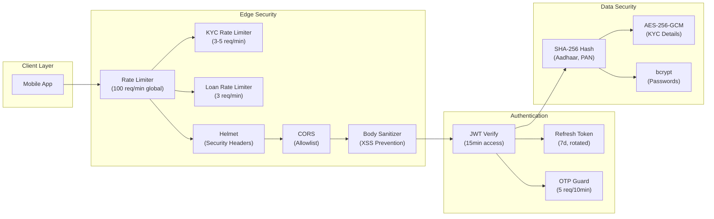
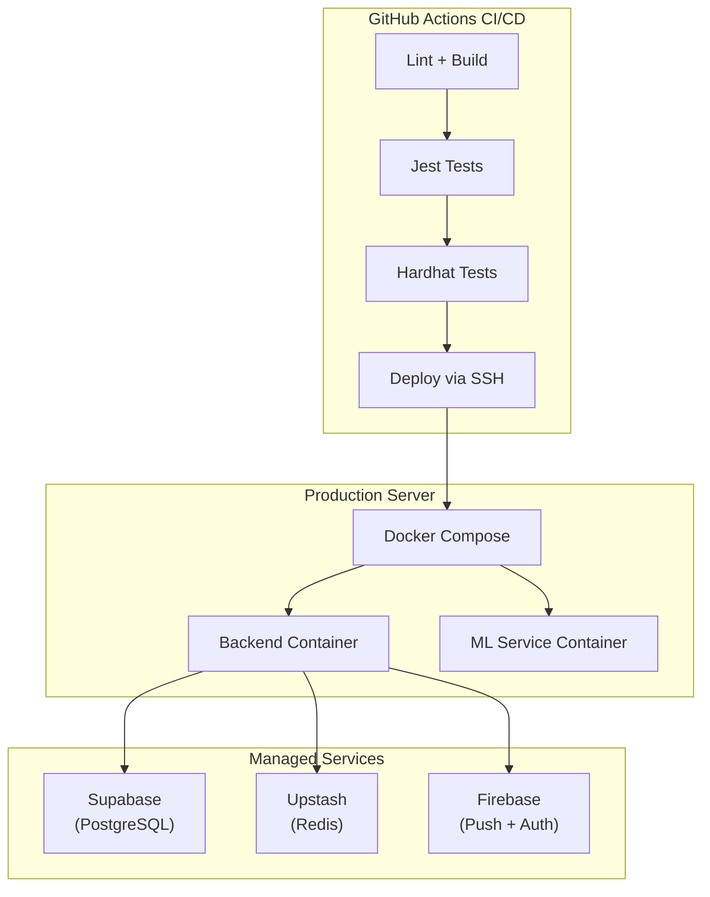

# GramChain — System Architecture

> Hybrid On-Chain DeFi Microfinance Platform

## High-Level Architecture

## Data Flow: Loan Application

## Data Flow: EMI Repayment

## Security Architecture

## Infrastructure (Target Production)

